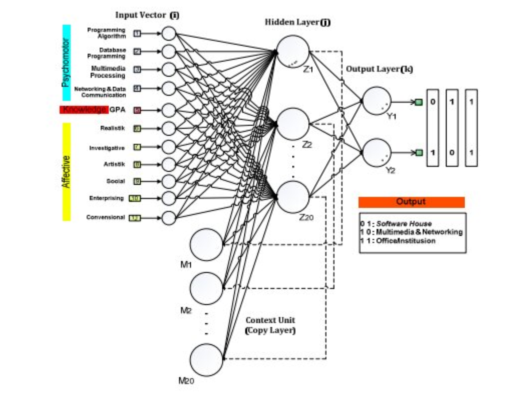

# A Piece of InternBit

## Sum It Up
In our [InternBit Resources Page](https://radgrad.github.io/docs/internbit/resources/), it gives information about the recommendation extension system we are working on for the InternBit part of the RadGrad2 project.  I am a new intern helping out with this project, and in order to know what I have to do, I needed to know what the purpose of InternBit is.  Our goal essentially is to scrape data off of internship websites and be able to deliver an accurate recommendation for students that would match their interests and qualifications.  
### Recommendation System
Ishan Nangia uses a system called hybrid filtering, which includes three types of filtering systems.  One is Collaborative Filtering that finds which user is using which item and also finds user/item pairs that are similar.  This relies on how the users interact in order to compute a metric for understanding similarities between users or items.  The second is Content-Based Filtering that is similar to CF, but doesn't rely on users interacting with items.  Instead, it relies of background information on users or items.  The last is Knowledge-Based Filtering, which takes in information provided by the user and uses preferences to suggest items.  This relies on the user's input.  His process is to collect data scraping from an intership website, cleaning the data preparing it for analysis, analyzing the data using it to answer questions to understand trends, and making the recommendations that are relevant, unique, and serendipitous. 

Testing is also just as important as creating a product.  The two ways in which the project is judged.  One way is to deploy two tests where the control group is recommended internships randomly and the second group (treatment group) is recommended using the model.  The second way is the create a pop-up, and when the user clicks on the recommendation, then that allows the user to rate (on a scale to 5) how relevant the recommendation was.  Obviously, they are two completely different techniques because one is for sure going to get feedback and the other is dependent on whether the user clicks on it.  They both get the same job done, though.  

### AI-Based Recommendation System

Internships are an important step in a students career because it helps her/him gain confidence in their work by becoming familiar with the chosen workplace.  If someone has a bad experience at an internship, then that could leave them back to square one and lost.  That's what this system is for.  It is to help recommend the best internships that fit the user.  The AI system is tested by using data collected from a group of students.  The students provide information about their skills, grades, aspirations, and interests as well as take a survey that analyzes their attitudes and behavior.  The result of the system was a great success of an accurancy level of 95% in finding internship placements that were assigned to students.  Their next test will be with a much larger training dataset.  The AI system can recognize training and testing data very well.  

### Wireframing Tools
In this article, 100 design experts were asked two question on what is their favorite and second favorite wireframing tools and why.  The website listed 10 of the most well-known or decorated design specialists and their answers.  It seems that Figma was the most popular whether as a first or second choice and Sketch was the runner-up.  Axure and Adobe XD were mentioned a couple times as well.  My favorite was Adam Cain's answer, which was a pen, pencil, and 8x10 copy paper.  Figma was mostly chosen for it's fluidness, in-built prototypes, available platforms, and project management features.  Sketch was chosen because of its clickable prototypes, can change on the fly, test on device, and flexibility with purposes.  They both make it easier for designers and allow them to work with minimal frustrations.  I guess it just depends on the designers and what they are comfortable with. 

## Relation to InternBit

InternBit has the same goals that I have read in the resources page.  The purpose is still to make the internship finding process easier and more effective.  Students spend so much time looking through endless websites and trying all types of filters.  Our goal is to remove that frustration and let the system do the hard work.  I think the system will have an easier time finding recommendations for a student who knows what he or she wants to go into.  But for someone who is still unsure what path to take, the recommendations might be a little more broad.  This is where InternBit could maybe split and be unique from other recommendation systems.  I'm sure we all have been there or are still experiencing that confused state in our lives where we don't know exactly what road to go on.  What if our system could help the user choose as well.  In all internship job offers, they have descriptions of what the responsibilities are like.  There could be an option where a student can search her filtered recommendations of different types of internship responsibilities.  This will deliver the basic duties and will maybe help that undecided student picture what it would be like in that workplace.  It would make it a more personal search than giving her a huge list because he or she doesn't know exactly what they want.  In my experience, people react more with systems that they feel more confident interacting with or make decisions easier.  
