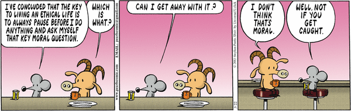

# Color Me Ethic

access image [here](https://i.pinimg.com/originals/5a/a3/33/5aa3332c4e16c7ce636ee36be50aebd7.gif).

## What is Ethics?

To me, ethics is a type of mentality like pride.  The reason I say this is because when you have ethics, it means you take pride in your work to do things correctly and professionally.  This comic strip above made me laugh because of its irony about ethics.  That mentality of "only if I get caught" is a very dangerous territory for software engineers because it may be tempting to slyly meander around minute rules.  I think it is super important for a software engineer to train their mentality to question their actions at all times like would it matter to you whether your family was proud or shamed by your publicly exposed actions? Would it matter to you whether, looking back, you saw this as one of your better moments as a human being, or one of your worst? This new generation is based on technology and will probably continue to flourish in the future.  Being that, it is important for software engineers to have ethics when they do any type of work.  I like to think of it as a domino effect.  Let's say you are hired to make a website for a start up business.  Things that should already be going through your head is: they don't have a lot of money to begin with, they are trusting you with this huge milestone for their business, and this will make or break whether they attract and keep customers.  These are the first steps to being an ethical person because you can't figure out what you are risking if you don't know how it could affect the other person.  And if you don't know how it affects the other person, then you won't have ethics or motivation to do your best.  

## Google StreetView Case Study

This [case study](http://courses.ics.hawaii.edu/ics314s20/morea/ethics/experience-se-ethics-case-study-privacy.html) of privacy on Google is something that is very relevant right now since this COVID-19 has everyone on quarantine.  All these businesses and schools have to go online for everything and must work through the internet to keep their heads above water.  Privacy is one of the most ethical and legal concerns with software.  Passwords, personal legal information, credit cards, schedules, etc. are all important assets of a person.  If those assets were to be stolen, then it could greatly affect someone in many ways most likely being financial or possession.  This case focuses on the Google StreetView feature in 2010, which displays aerial and street-view photographs of neighborhoods, city blocks, stores, and individual residences.  Some photographs captured some moments that violate someone's privacy such as patients leaving abortion clinics, children playing naked, employees playing hooky from work, etc.  When those people would request the removal of those violating images, Google presupposed that the users were aware of the breach of their privacy.  Over time, Google admitted that the Google vehicles software was collecting and storing personal data from unencrypted Wi-Fi networks (SSID's, device identifiers, medical & financial records, passwords, email content).  Of course, Google doesn't want the whole company to take the fall so they pin it on one 'rogue engineer', but it was learned that this 'rogue engineer' did communicate to his superiors.  Google settled a lawsuit with 38 states for the breaches of $7 million and they set up an annual privacy week for its employees.  

## Question Your Actions

The comic I picked above is actually way more hilarious now because I did not plan for it to match my case study.  Since it matches perfectly to this situation, it brings me back to how that mindset of "only if I get caught" is a really easy and dangerous mentality to slip into.  This mentality cost Google $7 billion dollars!  I know that isn't a lot for Google, obviously, but if it was a less successful business, then this could leave them in big debt causing a domino effect for the lower tiers in the company.  In Google's case, that lawsuit was minute to them so their ethics wouldn't encompass a domino effect on their employees.  Instead, their ethics would be how they want their company to be viewed.  They broke at least 13 rules in the [ACM Code of Ethics](https://www.acm.org/code-of-ethics).  They knew it was unprofessional and ethically wrong for them to leave images up and hack peoples' personal information even after it was brought to superiors.  They should've put themselves into the customers' shoes and asked if they would be okay with that.  Would you want your private life completely open to the public for everyone in the world to see?  Would you come out with the new found information of the Google vehicle to show the people you are willing to fix it or are you going to risk bad publicity and lawsuits to hide this privacy violation?  Are you willing to compromise your ethics and morals to collect data you probably don't need for something you know will hurt other people?  

The bottom line is that ethics is important for software engineers because we hold information that the whole world doesn't see.  It is our job to be ethical and protect people from situations that could be fixed or avoided.  I think the most important thing for a software engineer to ensure he or she is being ethical is to question his or her actions and thought process.  Think about who and how it can affect others.  Being selfless is a good trait to have. 
