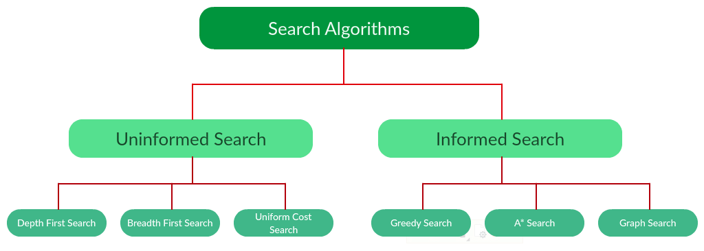
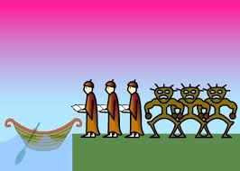
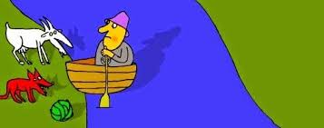
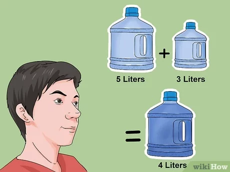

=======================================================================

## About Heuristic Searches

Heuristic searches are apart of the A* algorithms that we use to "guess" the best route from a start state to the goal state.  This can also be known as a Best-First-Search algorithm because it will order the OPEN list based off of the f(n) value of each node.  The list will be order from least to greatest (or greatest to least) f(n) value depending on how you want to count the values.  For these three problems, the list will be least to greatest since I will be counting the amount of "pieces" out of place.  The equation that heuristic searches work off of is:

The g(n) value is the length of the parent path, and the h(n) value is the heuristic value of, in this case, the number of pieces out of place.  I will be using this f(n) value to organize my OPEN list and call the dfs on that.  The goal of the heuristic search will be to try and find a close enough estimate to the actual solution in order to help save time and resources.  Sometimes the A* algorithm doesn't always work in your favor.  It works well for short problems with exact solutions, but it doesn't believe in "regressing" to find the best answer.  The cannibals and missionaries problem is a good example because the exact solution has a couple moves where it needs to put back some to the west side in order to keep the restrictions at bay.  The heuristic search sees this as a worst choice so it doesn't want to choose it first.  There are advantages and disadvantages of heuristic searches, but it is the coders job to weight out those differences to choose the best AI algorithm.  

## About the Problems Used
I will briefly explain the objective and restrictions in each game as well as state what the start and goal states are for each.  I also attached a website that can give you a better understanding of what each problem is.  

### 1) Cannibals and Missionaries

Start state = '(3 3 W)
Goal state = '(0 0 E)
Moves = '(C1 C2 C1M1 M1 M2) --> C1 moves 1 cannibal east or west depending on where the boat is, C2 moves 2 cannibals.  C1M1 moves 1 cannibal and 1 missionary to the other side, and I am sure you can guess what the rest of the moves are.  

So the way I ordered the states is (Cannibal Missionary BoatSide).  Everything starts on the west side and the goal is to get everyone on the east without breaching the restrictions.  The restriction is that the number of cannibals on one side cannot exceed the number of missionaries on the same side unless there are 0 missionaries.  I also have to take into account that I cannot exceed "3" on one side or be less than "0" on one side.  

The heuristic value is found by adding together the nth 0 state and nth 1 state of the node.  This will tell me how many are still left on the west side, so the start state heuristic value is 6.  

[C&M Problem Explanation](https://en.wikipedia.org/wiki/Missionaries_and_cannibals_problem#:~:text=In%20the%20missionaries%20and%20cannibals,were%2C%20the%20cannibals%20would%20eat)

### 2) Farmer, Goat, Wolf, and Cabbage

Start state = '(1 1 1 1)
Goal state = '(0 0 0 0)
Moves = '(farmer-takes-wolf farmer-takes-goat farmer-takes-cabbage farmer-takes-self) --> I think these moves are pretty self-explanatory.

The 1's in the states represent the objects on the west side and the 0's represent the east side.  They all start on the west side and the goal is to move all of them to the east.  Restrictions are that the goat and wolf cannot be alone on one side as well as the goat and cabbage cannot be on one side alone.  

The heuristic value is found by just adding up each nth state in the node because if it is a 1, then I add that, whereas if it is a 0, it adds nothing.  The start state has a heuristic value of 4.

[F,W,G,C Problem Explanation](https://illuminations.nctm.org/BrainTeasers.aspx?id=4992#:~:text=The%20Wolf%2C%20Goat%2C%20and%20Cabbage&text=His%20rowboat%20has%20enough%20room,cabbage%20safe%20from%20their%20enemies.)

### 3) 5-3 Water Jugs

Start state = '(0 0)
Goal state = '(4 0)
Moves = '(fill5G 3F5-to3 fill2-5G empty3 2F5-to3 1F5-to3) --> These moves will need a little more explaining.  The fill5G just fills the whole 5 gallon jug. The 3F5-to3 will take 3 gallons from the 5-gal jug and puts it into the 3-gal jug.  The fill2-5G will add 2 gallons to the 5-gal jug.  The 2F5-to3 is the same as the other one just 2 gallons instead of 3 and same with 1F5-to3 is with 1 gallon.  

The left of the state represents the 5 gallon jug and the right represents the 3 gallon jug.  Technically the right side goal state can be any number, just as long as the nth 0 state is 4.  My check methods will ensure that the moves won't orverfill or subtract too many gallons to the jugs.  The 5 gallon jug can't exceed 5 or be under 0, as well as the 3 gallon can't go over 3 or below 0.  

The heuristic value of this would be the difference of the nth 0 state and 4.  I take the absolute value of the answer because I know that 4-5 is -1, but it still counts as "out of place".  

[5&3 Jug Problem Explanation](https://www.math.tamu.edu/~dallen/hollywood/diehard/diehard.htm)

## Lisp Code Files
* [DFS-Search](https://github.com/auusui/auusui.github.io/blob/master/dfs.md)
* [Cannibals & Missionaries](https://github.com/auusui/auusui.github.io/blob/master/c-m-problem.md)
* [Farmer, Goat, Wolf, Cabbage](https://github.com/auusui/auusui.github.io/blob/master/fwcg-problem.md)
* [5 & 3 Water Jug](https://github.com/auusui/auusui.github.io/blob/master/jug-problem.md)
