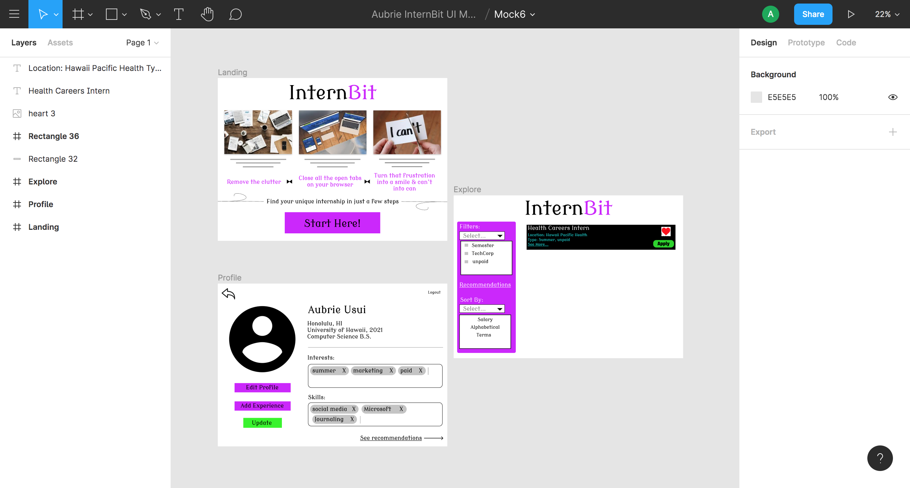

# InternBit for RadGrad

For eleven weeks of Summer 2020, I had the greatest opportunity to partake in a research and software development project.  I learned so much during this process, and it gave me a real life experience of what software development is like.  This project was challenging and time-consuming yet very rewarding once you see results.  I learned to scrape websites using Javascript Libraries such as X-Ray, Tatooine, Osmosis, and Puppeteer.  I think that X-Ray was a super easy tool to use if your goal is to grab surface information.  If you want to grab more in depth information like going to the #href source, then Puppeteer was a great too for that.  I got to experience the libraries' strengths and weaknesses and compare the usage.  I came out of this internship with a better knowledge of what I want to do in the future and I feel confident that I could ace a course on all of the activities we did over this summer.  I think that is what internships are for.  You want to get a taste of what it would be like in a specific field and if you would enjoy doing it.  This is why I was happy to be working on this project because I want other students to be able to experience this.  An internship can assure a student's dream job or steer them to a new direction if it isn't what they enjoy.  I think it matters to be passionate about what you're doing, but that was just a bonus to this internship.  I believe this project can help a lot of students find the path they want to take in life, and I am glad I was able to contribute to this.  

## Abstract

InternBit is a research project that aims to aid ICS students in finding internships via an internship recommendation system and increase RadGrad engagement. It works by scraping internship results from popular internship sites, which is then analyzed for related skills so that both the internship and its related skills are inputted into the internship recommendation system. Upon using the system, users input their own skills into the system. This matches the users with internships that use similar skills via the internship recommendation system, so they can get recommendations for internships they both qualify for and are likely interested in. Integration with RadGrad streamlines this process further, as RadGrad gathers data from users, such as courses taken and ICS experience outside of school, which provides a better profile for the internship recommendation system to work with. If opted in, students will be able to receive weekly emails regarding the recommendations. This will also provide insight to the institution because they can trace back to see which courses/opportunities they learned the skills from to see if the institution is adequately preparing their students for the workforce.

Here is a link to the [InternBit](https://radgrad.github.io/docs/internbit/goals) main page where we explained the goals of this porject, our resources, the javascript libraries, our canonical schema, and evaluation.  

This picture is a screenshot of our UI design, which was mainly designed by Jenny Hsu. Here you can see the filters on the left, and the job cards on the right side.  


## What I Did

During this internship, we had tasks that were assigned to us every week or so to work on.  I learned a lot of new skills with these tasks and increased my experience with javascript.  

### Figma 

Figma is a framework website that allows users to created UI designs.  When we first started this internship, one of our first tasks were to create 6 UI mock-ups of what we think our static site would look like.  Here is an example of one of my designs to give you a peek into what Figma allows us to do.  




### Javascript Libraries

* [X-Ray](https://www.npmjs.com/package/x-ray)
* [Tatooine](https://www.npmjs.com/package/tatooine)
* [Pupeteer](https://www.npmjs.com/package/puppeteer)
* [NightMare](https://github.com/segmentio/nightmare#api)

Our first step to gathering information was to get comfortable with different javascript libraries.  My first was X-Ray, and it took me a while to understand how to work it.  After I started to get the hang of it, I felt dumb because it was so easy!  I did a lot of research on the different functions I could use and how to scope on certain areas of websites.  I found it hard to get more in detail information, though, so I decided to try Tatooine and Nightmare once I finished scraping my websites with X-Ray.  I wanted to see what different results I could get.  I have written an essay on my experience with [X-Ray](https://auusui.github.io/essays/x-ray-scraper.html). 

Tatooine was way different than X-Ray, whereas Nightmare was similar to Cheerio and Puppeteer.  I couldn't quite understand how it all worked, and I even tried working on it with my teammate using CodeTogether.  Before I could figure it out though, the group decided it would be best to focus on X-Ray and Puppeteer so we would all use the same library.  We then decided on a [canonical schema](https://radgrad.github.io/docs/internbit/canonical-schema) that we would format our JSON file in.  

Puppeteer was probably my favorite scraper to use because I could code each step that I wanted it to do.  I had to login to some of the sites so I used functions like type() and click().  Here is a snippet of my code for inserting search keywords to filter the internships: 

```JS
    await page.waitForSelector('input[class=form-control]');
    await page.type('input[class=form-control]', 'technology');
    await page.waitFor(3000);

    // focus on location field- type nothing
    await page.focus('#location');
    await page.keyboard.down('Control');
    await page.keyboard.press('A');
    await page.keyboard.up('Control');
    await page.keyboard.press('Backspace');
    await page.type( "#location", " ");
```

It was easy to create the JSON canonical format.

### Remote Pairing

Since this internship was during the Covid-19 pandemic, we weren't allowed to see each other in person.  I think face-to-face interaction is way better than just chatting online because you can achieve more in less time.  The way we tried to replicate this was using [CodeTogether](https://www.codetogether.com/).  This allowed us to simultaneously work on the code on the same page.  We then connected over Discord to talk over the phone, basically, while working on the code.  I think CodeTogether was a great tool to use with my teammates because it made it easier to assist in fixing issues since both people could see the entire code physically instead of snippets.  It was a little more difficult than talking in person, but under the forced circumstances of social distancing, it was actually easier than I thought it would be.  Technical difficulties happened like my internet cutting out or having to set time aside to go on Discord at the same time, but other than that, remote pairing went smoothly.  I think this was a great experience because now people know that there are other ways to be efficient in a group project but also being safe from the pandemic.  With improvements in technology, people probably figured out that not everything needs to be in person.  

I have written an essay on [Remote Pairing](https://auusui.github.io/essays/remote-pairing-program.html) and its benefits.  

## My GitHub Repos
* [Puppeteer Repo](https://github.com/radgrad/internbit-scraper-au-Youtern)
* [UI Repo](https://github.com/radgrad/internbit-ui-au)
* [X-Ray Repo](https://github.com/radgrad/internbit-scraper-au-xray)


## Websites
* [CoolWorks](https://www.coolworks.com/search?q=technology)
* [Youtern](https://www.youtern.com/candidate/job_search/quick/results)
* [IHireTechnology](https://www.ihiretechnology.com/search?k=technology&loc=Honolulu,%20HI#!/search/c=&loc=Honolulu,%20HI&d=75&k=technology&o=14&searchtype=page-load)


## Essays

* [RadGrad Level Up](https://auusui.github.io/essays/radgrad-level-up.html)
* [A Piece of InternBit](https://auusui.github.io/essays/a-piece-of-internbit.html)
* [Remote Pairing Program](https://auusui.github.io/essays/remote-pairing-program.html)
* [X-Ray Scraper](https://auusui.github.io/essays/x-ray-scraper.html)


