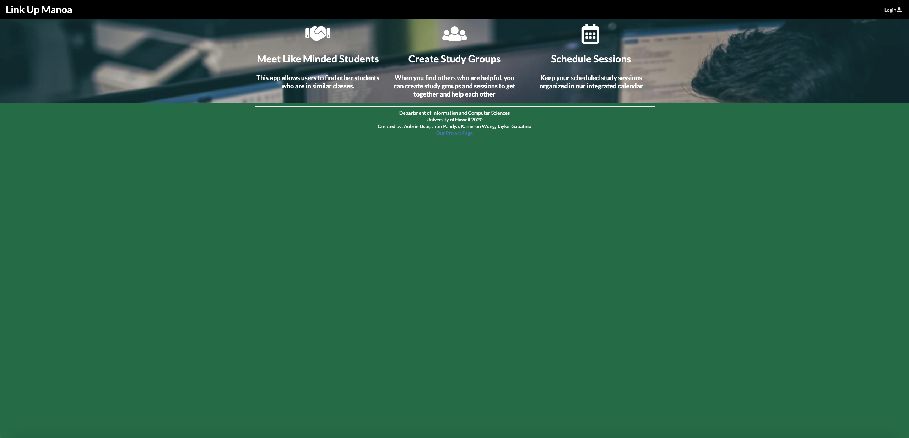

The problem we are addressing is that students tend to spend more time on their homework than they need and can't absorb the material as effectively as they should.  Students don't get enough of smaller ratio and face-to-face interaction with teachers or teaching assistants.  This app aims to solve this problem by allowing the students to self-organize study groups around specialties, courses, or majors.  The picture above is a screenshot of one of the pages that is implemented into our application.  There are more pages listed as you can see in the picture such as, a reminders page, user page, tutor search, etc.  Each page has a specific function. With this project, I was in charge of creating the friends page.  This included making a search bar to find users and adding friends. It also had an interal tab bar where it showed cards of users who were friends and users that requested to be a friend.  The back-end entailed figuring out how to send a friend request to users and what to do when the receiving user accepted or declined the request.  My other responsibility was a part of the reminders page.  I had to connect the cready study session page to create a study session card in the reminder page whenever one was created.  The card also allowed the user to RSVP where they were going to attend the session.  

The landing page is what the user first sees and it explains what our app is trying to accomplish as well as what they will receive upon signing up.  The user page will show your information that you input from registration.  The create study session page will allow you to basically create a session at a place, date, time, and what subjects you will cover.  This session will show up in your reminders page and will allow you to approve or decline acting as an RSVP.  The session card also has a feed component where the user can add notes onto the card for last minute modifications or comments. Also on the reminders tab, there will be a to-do list that allows the user to create his/her own reminders on the side.  The tutor list page allows users to look for tutors on the database that fits their study needs.  The last page is the friends page, which shows reccomendations of friends with similar majors, an searchbox to find other friends, and an internal tab bar that shows friends and requests.  These are the components that make up our app. 

Going into this project, I didn't expect it to be as much work as it was.  There were so many components that we had to connect and figure out.  I got frustrated so many times, but somehow I got through it.  It takes a lot of patience to make an idea come to life.  Even though the project isn't completely finished, we put alot of hours in to make it as best as we could.  The front end designing was definitely easier than the back end part.  I had so much trouble trying to figure out the back end, but I also didn't know all the functions that we could use.  I think that if I had a better understanding of all the functions and what their purpose was, it would have been a bit easier.  There were so many times I wanted to throw my computer across the room or scream at the app because it didn't do what I wanted no matter what I tried.  Computers can be so stubborn sometimes.  Despite the brain teasers, the learning process was somewhat fun...when I figured it out.  I have learned a lot doing the project and I can only get better.

If you wish to learn more about this app, this is the link to our [Link Up Manoa](https://link-up-manoa.github.io/) homepage and our [github repo](https://github.com/link-up-manoa/link-up-manoa).
