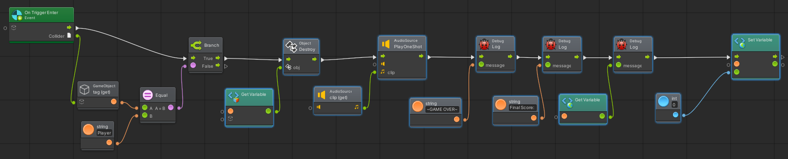
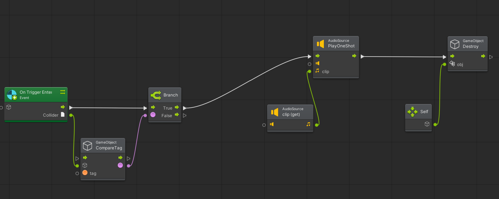
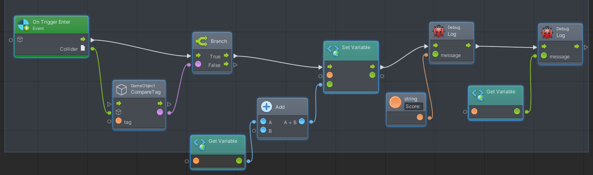

=======================================================================


## About the Game

I took a video game design class as one of my electives because I wanted to reach out to different fields that computer science offered.  In this class, our first assignment was to create a simple game with the objectives of collecting an item for a boost in score, obstacles that you need to avoid, movement with the keyboard keys, and play sounds when either collecting or running into an obstacle.  Because I am a CS student, we were required to do the movement in C# and then rest in Bolt or C#.  I wanted to use Bolt because it was a new skill that interested me.  


## C# Scripting
For the keyboard movements, I used the up, left, down, right arrows.  I worked on this project so that the Y plane is nonexistent.  The objects are only allowed to move on the X or Z axis.  The keys are like a usual game where the up arrow is going forward and the down arrow moves backward.  The left and right arrows are there to rotate the ball. 
Example of my movement script in C#:

```ruby
public class Movement : MonoBehaviour
{
    // Start is called before the first frame update
    void Start()
    {
        
    }

    public float speed = 0;

    private void FixedUpdate()
    {
        transform.Translate(0, 0, speed * Time.deltaTime, Space.Self);
    }

    void Update()
    {

        if (Input.GetKey(KeyCode.UpArrow))
        {
            speed++;
        }

        if (Input.GetKey(KeyCode.DownArrow))
        {
            speed--;
        }

        if (Input.GetKey(KeyCode.LeftArrow))
        {
            transform.Rotate(0, -1, 0);
        }

        if (Input.GetKey(KeyCode.RightArrow))
        {
            transform.Rotate(0, 1, 0);
        }
    }

}
```

A script I used to do a bounce effect on the walls, but it didn't seem to work the way I wanted.
``` ruby
public class Collide : MonoBehaviour
{
    private Rigidbody rb;
    Vector3 lastVelocity;

    // Start is called before the first frame update
    void Start()
    {
        rb = GetComponent<Rigidbody>();
    }

    // Update is called once per frame
    void Update()
    {
        lastVelocity = rb.velocity;
    }

    void OnCollisionEnter2D (Collision2D coll)
    {
        var speed = lastVelocity.magnitude;
        var direction = Vector3.Reflect(lastVelocity.normalized, coll.contacts[0].normal);
        rb.velocity = direction * Mathf.Max(speed, 0f);
    }
}
```


## Bolt in Unity
These images below are the flow machines I used for the obstacles and coins.  Bolt is very easy to use and I learned how to use it fairly easy.  It is just like scripting in C#, but it actually makes it easier for you because it will only show you connecting options that work.   At first, Bolt was very confusing to me because I didn't know where to put the pointer arrows, or where to start.  After looking at many tutorials, you start to see where it would go in C# scripting and translate it into the flow machine.  The more I saw examples, the better I was able to look at C# and make it into a flow machine.  This was a very good learning experience and I got to see how adaptable I am to new platforms.

# Obstacles

This is the Bolt flow machine I made for the obstacles.  You can see that if the object collided with is tagged as "Player", then it will destroy the host object.  It will also play a sound when the trigger is entered.  I also set the score back to 0, otherwise, when a new game is started, the previous score will remain.  At the end of the game, it will show you your final score in the console.  



# Coins

This is where I collect the coins on trigger.  When the host object runs over the coin, it will destroy the coin and add to the current score as well as play a sound.  



# Score Counter

The score counter will add 1 to the score if the object tag is "Coin".  In the assets, I created a tag "Coin" for all the collectable objects and changed it to this.  Whenever the score is incremented, it will show you your current score in the console.  




# Video Tutorial of Game

Here is the link to my video you can watch by downloading it.  It is a simple explanation of my game and how it works.  

* [Game Video](github.com/auusui.github.io/blob/master/Project1Video.mp4) 


