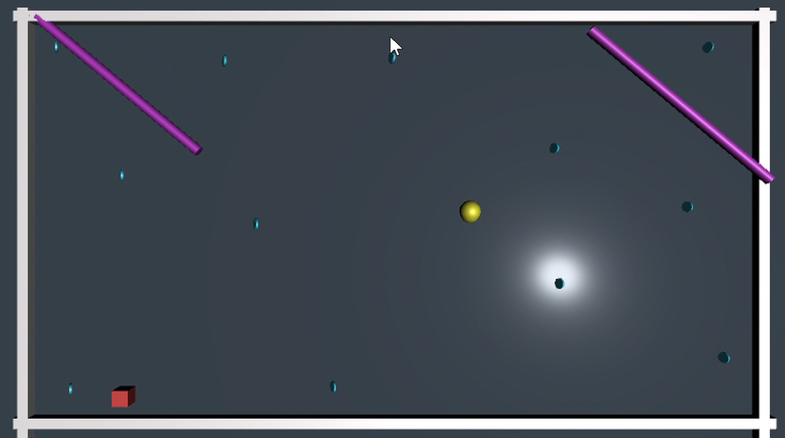

=======================================================================

## Websites

These are the websites that I scraped using the javascript libraries I had mentioned above.  

* [CoolWorks](https://www.coolworks.com/search?q=technology) -- X-Ray & Puppeteer & Tatooine & Nightmare
* [Youtern](https://www.youtern.com/candidate/job_search/quick/results) -- X-Ray & Puppeteer
* [IHireTechnology](https://www.ihiretechnology.com/search?k=technology&loc=Honolulu,%20HI#!/search/c=&loc=Honolulu,%20HI&d=75&k=technology&o=14&searchtype=page-load) -- Puppeteer

